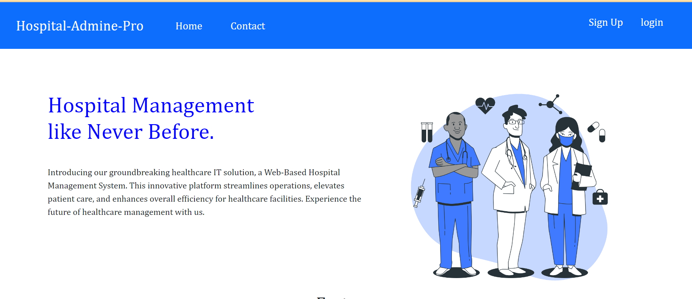
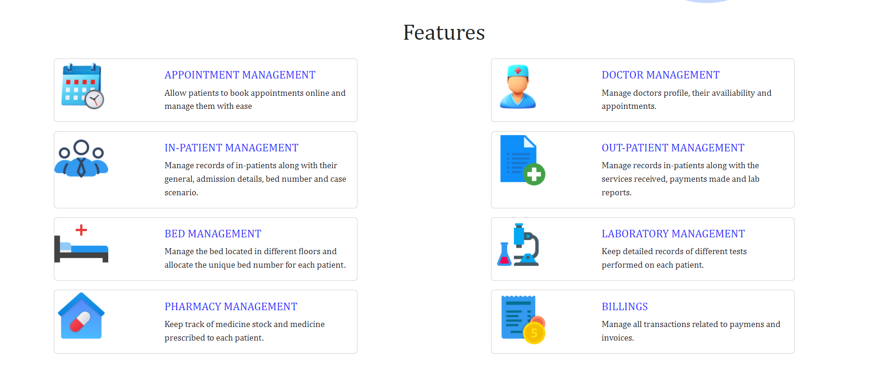
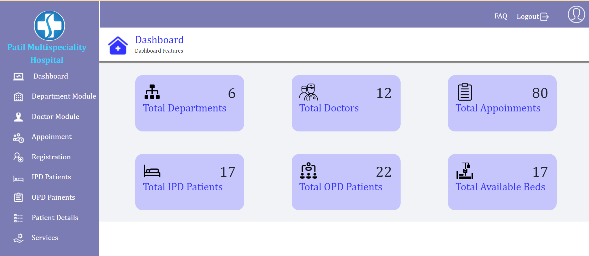
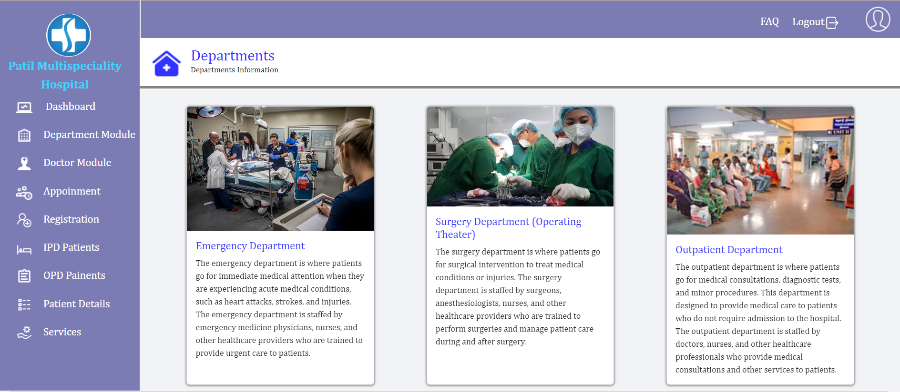
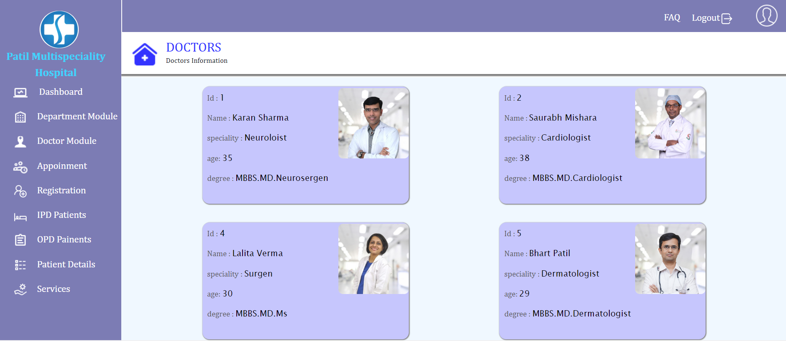
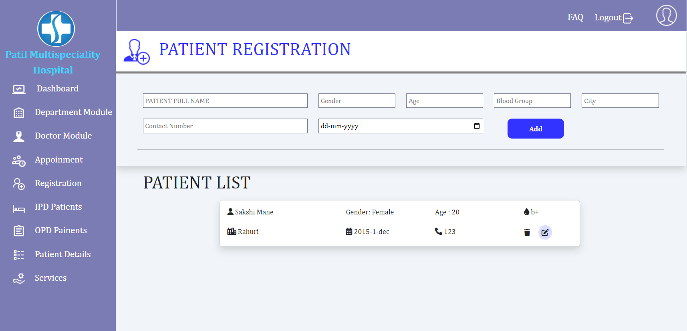
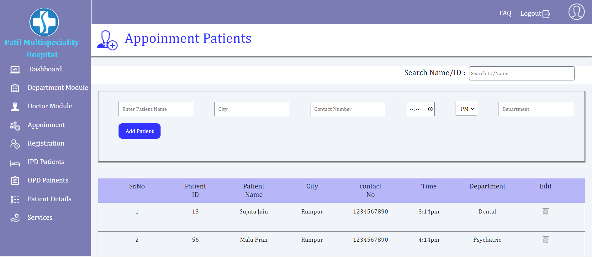
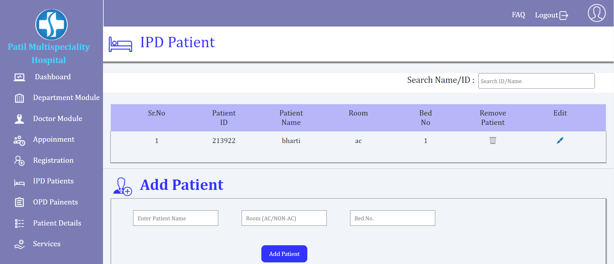
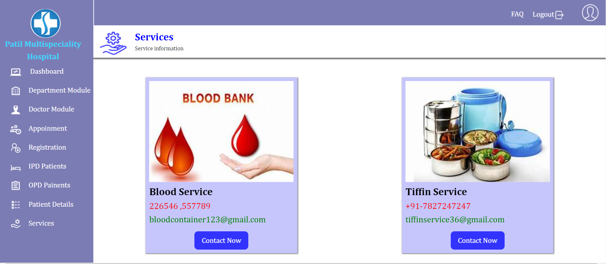

# Hospital Admin Pro🏥

## 🏥Hospital Admin Pro
**Homepage**
 
**Features**

**Dashboard**

**Department Module**

**Doctor Module**

**Registration**

**Appoinment**

**IPD**

**Service Module**

## Use Of Project

**Hospital admin Pro**is a system enabling hospitals to manage information and data related to all aspects of healthcare – processes, providers, patients, and more, which in turn ensures that processes are completed swiftly and effectively. 

## Description 📝
We have created this project using `HTML` ,`CSS`, `json` , `javacript`, `Node.JS`, `React`

 Making it user-friendly and accessible to Hospital administration, An Innovative Healthcare IT Solution, Featuring a Web-Based Hospital Management System, Designed to Streamline Operations, Enhance Patient Care, and Improve Overall Efficiency.

## Real Life Use🎊
Our platform is designed to assist  to the hospitals translates to being able to track patient history, provide better care, keep track of appointments, save patient insurance and payment data, enable doctors and clinicians to check patient history, maintain patient care continuity, and save time and effort on unnecessary tedious manual tasks.

## Future Scope🔮✨
The future of hospitalAdmin pro software in India is promising and full of possibilities. With the Internet of Things, hospitals will manage their patients more conveniently and effectively, with increased safety and better customer service.

## Contributors 👏

